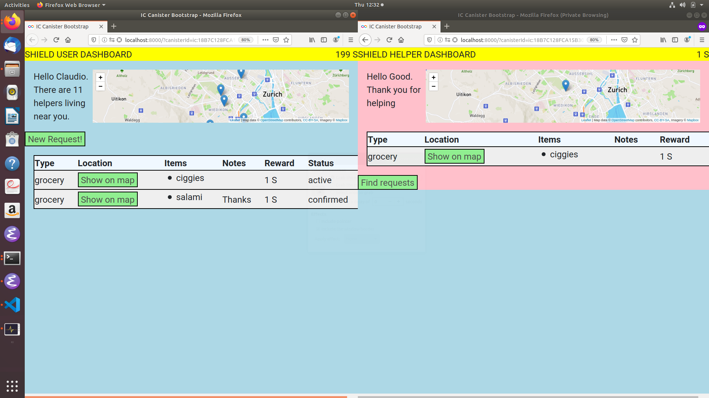

# Shield

Project Shield is a POC volunteering app, matching located helpers/volunteers with nearby vulnerable users requiring assistance (for shopping requests). Users have funds from which they reward helpers for completing requests. Users and helpers have associated balances of funds, denominated in `S` (shield) tokens.



[Slides](https://docs.google.com/presentation/d/1-4phUn7TjWgTSQT18IDQ8Hkhw9qcF9wSl4bLMZXqdxA/edit?usp=sharing) (may not be publically accessible)

[Screenshot](./images/shield.png)

[Supporting materials](https://drive.google.com/drive/folders/1XYAEynOAmfndBrFJzErdAYPyOF3b_27t) (may not be publically accessible)

[Video](https://youtu.be/DgCIdzJmLdM) (public)

# Requirements

* DFX 0.5.8 (!)
* React and other javascript detritus.
* tested on Linux (script run.sh may need adapting to MacOS).

# Guide to the code


The dfx project is a [multi-canister project](dfx.json) with 2 main canisters and 20 identical, replicated agent canisters used to simulate additional human users/helpers making/servicing requests.

* [Shield canister](./src/shield/): Centralized mutable registry of users, helpers and requests. The former are authenticated by caller id (for better or worse). Implemented using three base `HashMaps`.

* [Shield front-end](./src/shield/public/): react, multi-page (?) front-end displaying maps with pins for helpers and (nearby) requests.
Appearance basic but fully functional, should be stylable via css (future work).

* [Balance canister](./src/balance/): central *bank* managing user accounts storing shield tokens. Authenticated by caller id (for better or worse).
Endowed by shield canister, used both by users and helpers.  Account creation and transfers initiated soley by shield canister (the `trust` principal, for want of a better name).

* [User canister(s)](./src/user/) Generic user agent capable of impersonating a single shield user or shield helper. Used by test script [run.sh](run.sh) to prepoplute replica with small number of users and canisters.
Forged to set up an artificial environment of users/helpers located around Zurich. Each agent canister registers itself with shield.
Each user agent additionally makes a single request (for help purchasing some item).

* [Tokenomics](./src/tokenomics/) Exchange for converting balance canisters shield tokens to other token (ideally DFN). Sketched by resident economist but not yet used.

TODOs:
* rename user canister to more generic agent canister (serving role of shield user or helper).
* user-specified rewards in UI (implemented, but not exposed, default to `1` shield token).
* html input-validation
* token exchange.
* privacy-oriented design (we record way to much but that was the spec).
* Escrow to avoid overspend by user (user can make more requests than he can afford)


# Getting the code

```bash
git clone git@github.com:crusso/shield.git
```


# Running

Start the replica

```bash
$ dfx start --background
```

# Building

You must have started the replica first in order to for the build to obtain canister ids (see above).

```bash
$ dfx build
Building canisters...
Building frontend...
Bundling assets with canisters...
```

# Test Script

Once build, you can execute this script.

```bash
$ ./run.sh
```

Runs a little test script that (re-)starts dfx, installs all canisters, and starts some agent canisters (10 distinct users and 10 distinct helpers).

Prints two URLs, one for the (generic) CanDid interface, the other for the custom frontend UI.

Output:
```
...
Frontend UI: http://localhost:8000/?canisterId=ic:0D0000000000000000000000000000000001D2
```

Open the shield frontend URL in a browser, and again in private browser window(s), in order to register users or helpers with _different_ principals.


# Manual installation (sans test script).

```bash
$ dfx canister install -all
```

Note that dfx reports several canister ids - you'll need to use the actuall ID (not the ondisplayed here) in the following URLs for the `shield_assets` canister.

# Opening candid UI

E.g. (but using the actual canister ID returned on installation)

```bash
$ firefox http://localhost:8000/candid?canisterId=ic:0D0000000000000000000000000000000001D2
```

# Opening canister frontend UI

E.g. (but using the actual canister ID returned on installation)

```bash
$ firefox http://localhost:8000/canisterId=ic:0D0000000000000000000000000000000001D2
```

# Troubleshooting

If `dfx` or the replica goes south, try getting back to a good state by doing this:


```bash
dfx stop
rm -r -f .dfx
rm -r -r canisters
```
and restart


```bash
$ dfx start --background
```
